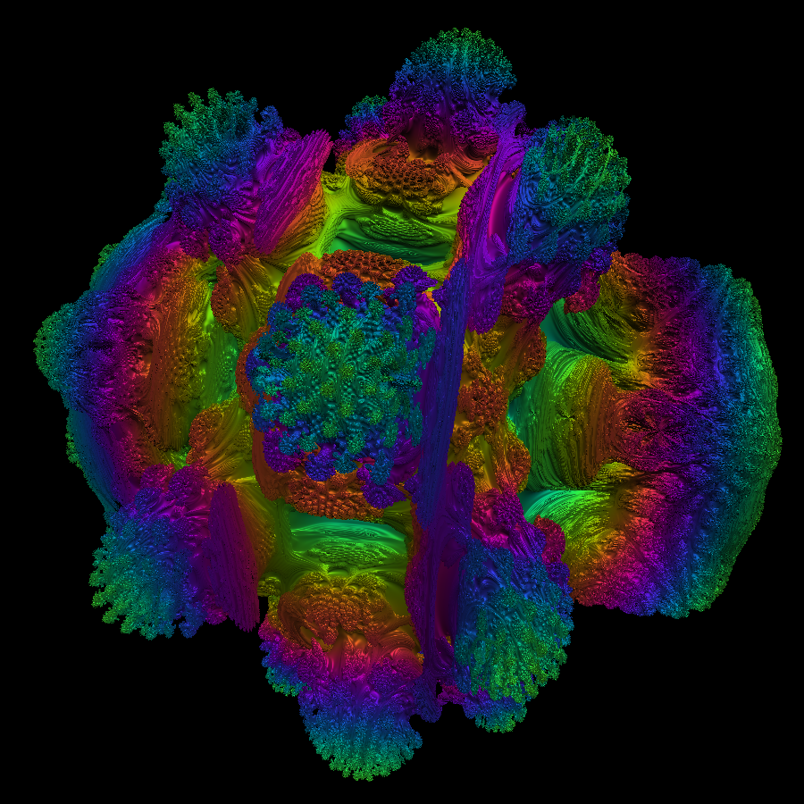

# VSBM Native

A native macOS volumetric shader renderer — an exact Metal port of cznull's
[volume shader benchmark](https://cznull.github.io/vsbm) (the "毒蘑菇" / poison
mushroom Mandelbulb), built for maximum frame rate rather than for a browser.

AppKit + Metal, no third-party dependencies, no Xcode required.



*`VSBMNative --render docs/frame.png --size 900x900 --preset reference`*

## What it is

The reference renderer marches a signed field with a fixed 0.0032 step, 1000
samples per pixel, no distance-field acceleration and no early-out. That is
deliberately brutal, and it is why the online benchmark can stall a phone. This
app reproduces it exactly, then gives you the tools to find out precisely what
each acceleration costs:

- **Reference preset** — bit-faithful, 1024×1024, reference step and iteration
  counts, safe math. Scores from this preset are the only ones comparable with
  the web benchmark. On an Apple M4 it runs at **7.4 FPS**.
- **Balanced / Performance presets** — bit-exact rewrites, a bounding-sphere
  early-out, optional fast math, and adaptive resolution driving a target FPS.
- **Every knob is exposed and every deviation is measurable.** "Compare with
  faithful reference" renders both configurations and reports the pixel
  difference, so a speed-up is never a hidden quality loss.

Measurements, including a correction to an earlier bad number, are in
[`docs/performance.md`](docs/performance.md). The port and each optimisation are
documented line by line in [`docs/algorithm.md`](docs/algorithm.md).

## Install

Requires macOS 14+ and the Swift toolchain. Xcode is **not** needed.

```sh
scripts/build-app.sh                    # builds dist/VSBMNative.app and ad-hoc signs it
cp -R dist/VSBMNative.app /Applications/    # install
open /Applications/VSBMNative.app
```

The bundle is self-contained and ad-hoc signed, and because it is built locally
it carries no `com.apple.quarantine` attribute, so Gatekeeper does not block it.
After copying, register it so Launchpad and Spotlight find it:

```sh
/System/Library/Frameworks/CoreServices.framework/Frameworks/LaunchServices.framework/Support/lsregister \
  -f /Applications/VSBMNative.app
```

Double-clicking the icon starts in the **Balanced** preset, which adapts its
resolution to hold 60 FPS. `⌘1` switches to the bit-faithful Reference preset.

The icon is generated from a frame the app renders itself, so it cannot drift
from what the renderer actually produces:

```sh
scripts/make-icon.sh
```

Or run the executable directly, which is more useful for reading diagnostics:

```sh
swift build -c release --product VSBMNative
.build/release/VSBMNative                       # normal window
.build/release/VSBMNative --preset performance  # start in another preset
.build/release/VSBMNative --kernel my.metal     # start with your own kernel
```

### Headless capture

Renders a single frame to a PNG with no window and no screen-recording
permission. Handy as a regression artifact:

```sh
.build/release/VSBMNative --render out.png --size 1024x1024 --preset reference
.build/release/VSBMNative --render fast.png --preset performance --sphere --sphere-radius 1.29
.build/release/VSBMNative --render box.png --kernel kernels/box.metal --len 4.0 --angle2 0.6
```

`--size WxH`, `--angle1`, `--angle2`, `--len`, `--panx/y/z`, `--max-iter`,
`--step-scale`, `--fast-math`, `--sphere`, `--sphere-radius`.

## Verify correctness

```sh
swift run -c release vsbm-selfcheck          # 54 checks, exits non-zero on failure
swift run -c release vsbm-selfcheck --bench  # also prints the performance matrix
swift run -c release vsbm-selfcheck --quick  # skip the slow GPU/oracle comparisons
```

The app can verify itself through the real window too:

```sh
.build/release/VSBMNative --preset balanced --soak 30
```

`--soak` runs the windowed pipeline for N seconds, then prints the delivered
FPS, the 1 % low, GPU time, the resolution the adaptive controller settled on,
and the controller's own reasoning. This is how the two bugs described in
[`docs/performance.md`](docs/performance.md) were found.

`vsbm-selfcheck` is a plain executable rather than a test target: this machine
has Command Line Tools only, so `XCTest` is absent and swift-testing's macros
cannot be loaded. It covers

1. uniform memory layout (Swift ↔ MSL),
2. camera vectors against values taken from the JavaScript reference,
3. shader assembly, diagnostics parsing and editor line mapping,
4. runtime compilation of every built-in kernel, plus clean failure handling,
5. **GPU output against a literal CPU transcription of the original GLSL**,
6. the bounding-sphere early-out (image difference *and* speed-up),
7. the compute backend against the fragment backend, and the upscale pass
   (including its vertical orientation),
8. adaptive-resolution convergence and thermal capping,
9. frame statistics and export,
10. presets and resolution sizing.

The fidelity check is the important one. `CPUReference` keeps every redundant
field evaluation the original performs, while the GPU shader removes them, so a
mismatch would mean the "bit-exact" rewrites are not bit-exact. Measured:
**mean |delta| 0.000809, max 0.007145, 0.098 % of pixels differing by more than
1/255.**

## Controls

| Input | Action |
| --- | --- |
| Drag | Orbit |
| Right-drag | Pan |
| Scroll / pinch | Zoom |
| `R` | Reset the camera |
| `⌘1`–`⌘4` | Switch preset |
| `⌘0` | Show/hide the settings panel |
| `⌘Q` | Quit |

The HUD shows instantaneous FPS, median GPU milliseconds, encode time, average
FPS, the 1 % low over the last 600 frames (the reference's own window), p99 GPU
time, preset, kernel, internal and output resolution, render scale, backend, the
active fidelity deviations, and thermal state. "Export report…" writes JSON plus
a per-frame CSV.

## Writing a kernel

The kernel is a Metal function; the app supplies the prelude and the marcher and
splices your text between two markers.

```metal
static inline float sdf(float3 p) {
    return 1.0f - length(p);      // > 0 inside, < 0 outside
}
```

- The function **must be named `sdf`**. `kernel` is a reserved word in MSL — which
  is exactly why the original JavaScript fork renamed it to `kernal`.
- Positive inside, negative outside, matching the reference's sign convention.
- Built-ins: `mandelbulb8` (the original), `box`, `sphere`, `menger`.

Edit it from **Edit kernel…** (compile errors are reported against *your* line
numbers, since the app knows how many prelude lines precede your text), or load a
file with **Load kernel from file…** and tick **Reload file on change** to edit it
externally and see each save applied. Compilation takes about 35 ms, and a failed
compile keeps the previous working pipeline so the view never goes blank.

## Layout

```
Package.swift
scripts/build-app.sh              assembles and ad-hoc signs the .app
Resources/Info.plist
Sources/VSBMNativeCore/           no AppKit: reusable and testable
  Camera.swift                    camera state and reference interaction maths
  CPUReference.swift              the literal GLSL transcription used as an oracle
  FrameStats.swift                GPU/CPU timing, 1 % low, JSON and CSV export
  MetalRenderer.swift             pipelines, encoding, readback, probe, benchmark
  AutoResolution.swift            adaptive render scale and resolution sizing
  Presets.swift                   named, fully-specified configurations
  ShaderSource.swift              MSL assembly, diagnostics mapping, built-in kernels
Sources/VSBMNative/               the AppKit application
Sources/VSBMNativeSelfCheck/      the verification executable
Tools/reference/                  regenerates the camera reference values
docs/algorithm.md                 the port, in detail
docs/performance.md               measured numbers and methodology
```

## How the performance comes out

Measured on an M4 at 1024², with the reference kernel:

| | FPS |
| --- | --- |
| Reference preset | 7.4 |
| + fast math | 9.1 |
| + bounding sphere | 10.1 |
| + both | 12.7 |
| Adaptive resolution instead holding 60 FPS | ~358×358 internal |

The point is not that 12.7 FPS is fast. The point is that the app tells you
exactly which of those multipliers costs you fidelity and which does not:

- Removing up to six redundant field evaluations per hit is **bit-exact** and
  always on.
- The bounding sphere is **1.37×** and on the reference view measured
  bit-identical, but it derives its radius heuristically, so it is opt-in.
- Fast math is **1.24×** and genuinely changes the arithmetic.

## Resource usage

Measured on this machine (Apple M4, 8-core GPU, Retina backing scale 2.0).

**On disk, 2.7 MB total**

| | |
| --- | --- |
| Executable | 0.60 MB |
| Icon (`AppIcon.icns`, 10 sizes) | 2.03 MB |
| Everything else | < 0.1 MB |

The icon is 75 % of the bundle because the 1024x1024 tier of a high-frequency
fractal does not compress well. `scripts/make-icon.sh` regenerates it.

**At runtime**

| Window content | Render view | Drawable | `phys_footprint` |
| --- | --- | --- | --- |
| 1440x900 pt | 1110x900 pt (2220x1800 px) | 3 x 15.2 MiB | 128 MB |
| 1000x700 pt | 670x700 pt (1340x1400 px) | 3 x 7.2 MiB | 105 MB |
| 700x500 pt | 370x500 pt (740x1000 px) | 3 x 2.8 MiB | 88 MB |

At 700x500 the breakdown is:

| | |
| --- | --- |
| Metal driver residency (constant — identical for a trivial `box` kernel) | 47 MB |
| `IOSurface` (the 3 drawables) | 9.5 MB |
| Malloc heap (AppKit / Swift) | 14 MB |
| `IOAccelerator` | 5.7 MB |
| CoreAnimation | 3 MB |
| Icon image data | 1.8 MB |
| `__DATA`, page tables, misc | ~7 MB |

**Window size is the dominant lever.** On a Retina display the drawable is
points x 2 in *each* dimension, so pixel area is 4x the point area, and the
three drawables are allocated at full window resolution regardless of the
internal render scale. Shrinking the window from 1440x900 to 700x500 saves
about 40 MB.

**There is no separate VRAM on Apple Silicon.** The GPU draws from the same
unified memory pool as the CPU, so the graphics portion (~62 MB above:
`IOSurface` + graphics-unmapped + `IOAccelerator`) is not additional to the
`phys_footprint` — it is part of it. On an Intel Mac with a discrete GPU these
would be separate, and the drawable cost would be charged to VRAM instead.

Startup peaks higher (90-146 MB depending on window size) while the shader
compiles and the bounding radius is probed. A five-minute run holds flat
(91-94 MB), so there is no growth over time.

## Attribution

The rendering algorithm is cznull's. This project is an independent Metal
reimplementation with a correctness oracle, a hot-reloading kernel editor, and
measurement tooling.
